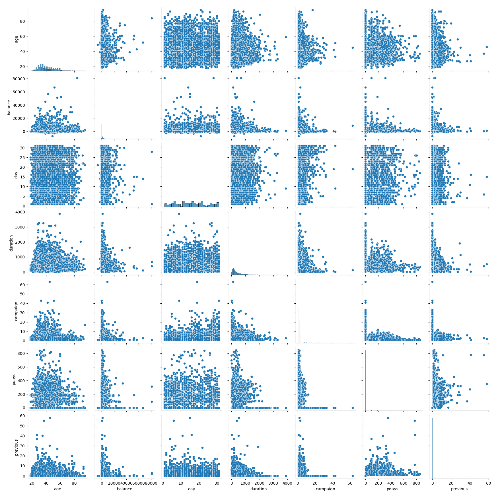
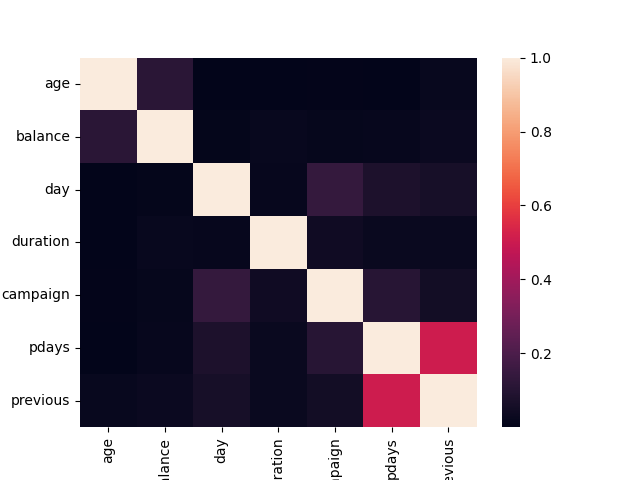

## Introduction

Spark est un framework open source de calcul distribué développé à l'université de Californie. C'est un puissant moteur de traitement open-source, il permet des analyses d'importants volumes de données, avec des API en Java, Scala, Python, R et SQL, il est facile d'utilisation et largement utilisé. 
Spark exécute des programmes jusqu'à 100 fois plus vite que Hadoop et MapReduce en mémoire, et 10 fois plus vite sur disque. 

Il peut être utilisé pour créer des applications de traitement de données en tant que librarie ou pour effectuer des analyses de données de manière interactive. Spark fourni de nombreuses bibliothèques dont SQL, DataFrames et Datasets, Mllib pour l'apprentissage automatique, GraphX pour le traitement des graphes et Spark Streaming. 

De plus, Spark est multiplateforme et peut accéder à diverses sources de données, notamment HDFS, Apache Cassandra, Apache HBase et S3.

Mllib est la librairie originale de Machine Learning pour Spark, et elle est construite sur les RDD alors que Spark ML, une librairie plus récente est conçue sur les DataFrames. Dans ce sujet nous nous concentrerons sur la librairie MLlib de Spark. MLlib fonctionne particulièrement bien avec Python et R, elle interragit même avec NumPy. Cette API est majoritairement utilisée puisqu'elle est jusqu'à 110 fois plus rapide que Hadoop. 

Cette librairie est très complète puisqu'elle est capable de sous-traiter les principaux problèmes de Macine Leraning comme la classification, la régression, le clustering, la modélisation etc. D'ailleurs, tous les algorithmes de MLlib sont optimisés pour le calcul en parallèle sur un cluster.

Par la suite nous verrons quelques exemples de code que nous allons essayer d'expliquer pour comprendre au mieux ce framework. Pour ce faire nous avons manipuler MLlib avec pyspark qui comme son nom l'indique correspond à l'API De spark pour python. L'installation de hadoop est nécessaire pour utiliser cette librairie pour permettre une gestion des fichiers.

## Fonctionnement

Comme nous l'avons expliqué plus tôt, MLlib nous contraint d'utiliser des RDD. Pour mieux comprendre comment fonctionne MLlib il faudrait d'abord savoir ce qu'est un RDD. Ce concept a été mis en place par les fondateurs de Spark, et représente des collections immutable, où chaque éléments est représenté en ligne. Par la suite on pourra faire deux type d'opérations sur ces fichiers, des transformations ou des actions comme un count.

Ce qui est intéressant avec cette librairie, c'est le fait de stocker les jeux de données dans la RAM, ce qui permet d'avoir des résultats très intéressant lorsque l'on va faire des calculs sur des volumétries importantes. 

L'utilisation de ces algorithmes ce fera qu'en utilisant un des trois types de données suivant, les vectors, les labeledPoint ou les rating.
Les vectors peuvent être représenté de deux façons, soit de manière dense en spécifiant directement la donnée soit en ne spécifiant uniquement les données non nulles, et leur place au sein du vecteur.
Les labeledPoints sont utilisées dans l'apprentissage supervisé ce qui n'est pas dans notre interet, et les rating sont des données utilisée pour le filtrage collaboratif, une technique visant à déterminer le degré d'interet d'un objet pour un individu en se absant sur l'interet d'autres individus. Nous nous concentrerons uniquement sur l'utilisation des vectors. Il est important de préciser que ce type de donnée ne permet aucune opérations aritmétique.

L'entrainement pour un modèle se fera toujours de la même façon, elle dépendra uniquement de l'algorithme utilisée. Nous aurons d'abord besoin d'instancier une classe qui représente notre algorithme, si besoin il sera nécessaire de modifier les paramètres et ensuite nous aurons besoin de lui fournir notre jeu de donnée, suivant les trois types que nous avons cité plus tôt et pour finir appeler la méthode run() pour entrainer notre modèle, qui retournera un objet Model quand il aura finit.

Ce modèle servira ensuite pour prédire une valeur sur un autre RDD selon ce que vous essayez de calculer. 

# Cas d'usage 1

# Cas d'usage 2

# Cas d'usage 3